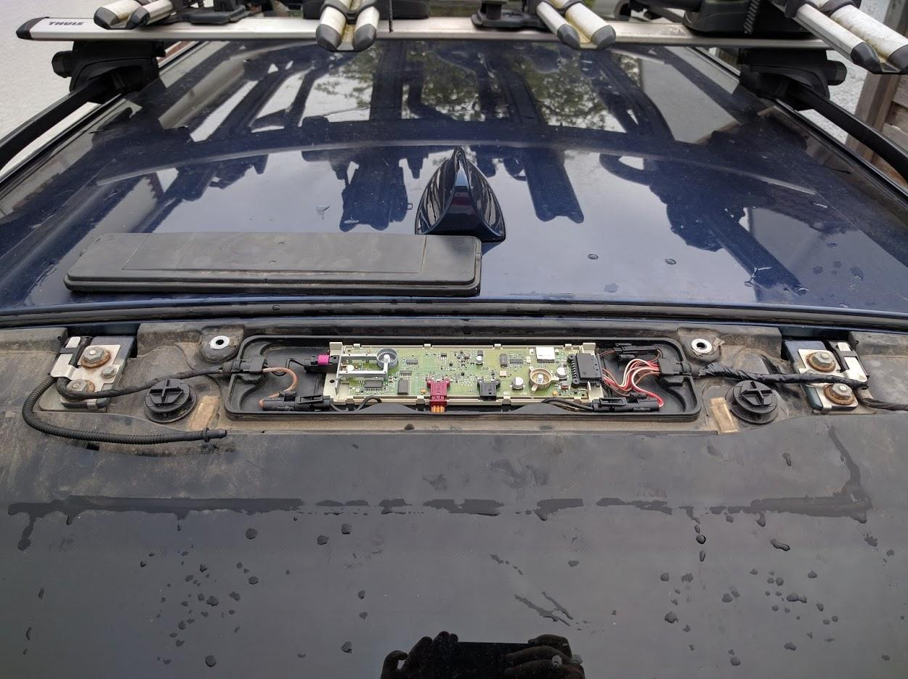

# https-imgur.com-a-bmw-e61-remote-fix-sWdk0

Content from https://imgur.com/a/bmw-e61-remote-fix-sWdk0 (first 8 images) and https://imgur.com/diversity-amplifier-re-installed-working-pz2Ag2N (last image) for Wayback Machine archival

Source: https://5series.net/forums/e61-touring-discussion-4/keys-remotes-fm-radio-not-working-anymore-93054/page3/#post1580046

1. https://i.imgur.com/wpOruGW.jpeg
   
   

2. https://i.imgur.com/VMjFknJ.jpeg
   
   

3. https://i.imgur.com/azQyeeD.jpeg
   
   

4. https://i.imgur.com/RD95OJ5.jpeg
   
   

5. https://i.imgur.com/krwSTOL.jpeg
   
   
   
   ...without this, there was no 5V rail on the board, so the remote key didn't work. Strangely, the FM amplifier worked ok, as I think it was powered from the RADIO_ON signal wire

6. https://i.imgur.com/7xpjsEB.jpeg
   
   

7. https://i.imgur.com/NuBbIhk.jpeg
   
   

8. https://i.imgur.com/UIxKC97.jpeg
   
   

9. https://i.imgur.com/pz2Ag2N.jpeg (This image is from https://imgur.com/diversity-amplifier-re-installed-working-pz2Ag2N)
   
   
   
   I have since applied a thick layer of grease around the outside of the black box to help keep water out of here. Fingers crossed!
